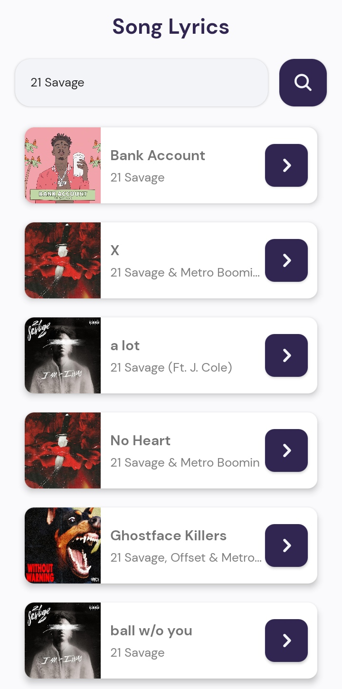
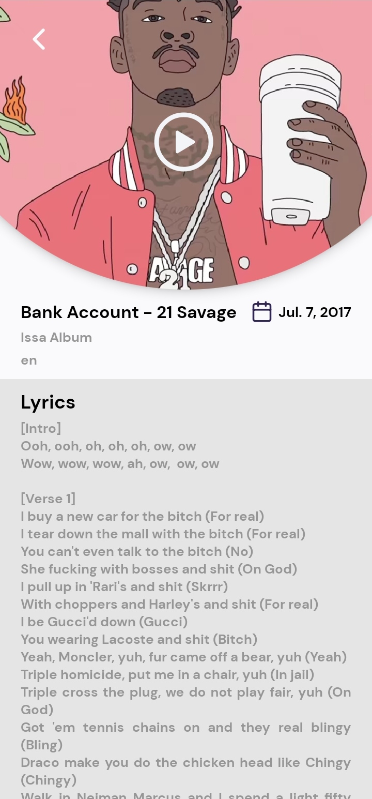
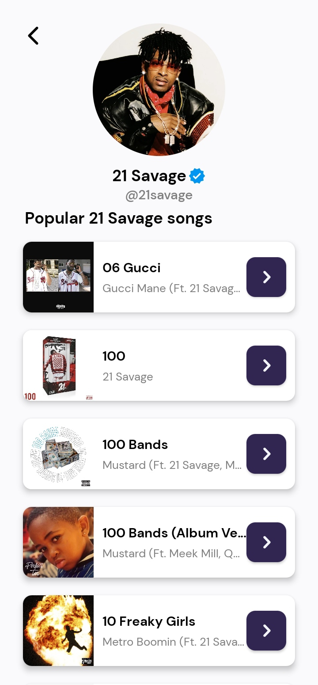

# SongLyrics

## Development
Clone the repository and run the following commands:
```
npm install
react-native run-android or react-native run-ios
react-native start
```

## ScreenShots
<div>
     
     
     
</div>

## Links
- 📫 How to reach me **imadidaliouali@gmail.com**
